# 监控服务器

**当前服务器 IP 为 `45.32.202.169`， 请根据需要替换为自己的服务器，否则可能会不成功**

## 安装 服务 和 mysql 等
### 装几个常用软件
```
yum install tmux vim git htop -y
```
### 同步下时间并设置正确的时区

```
rm -rf /etc/localtime
ln -s /usr/share/zoneinfo/Asia/Shanghai /etc/localtime
yum install -y ntp
ntpdate time1.aliyun.com
date
```

### 禁用防火墙

#### iptables
```
/sbin/iptables -F
/sbin/iptables -L
/sbin/iptables -S
```

#### selinux
```
sed -i 's/SELinux=enforcing/SELinux=disabled/' /etc/sysconfig/selinux
echo 0 > /selinux/enforce
sestatus
```

### 安装软件包

#### MySQL

```
yum -y install mysql-server
service mysqld start

/usr/bin/mysql_secure_installation
```
进入交互界面，一次作如下输入

1. 直接回车
1. toor
1. toor
1. y
1. y

参考下图

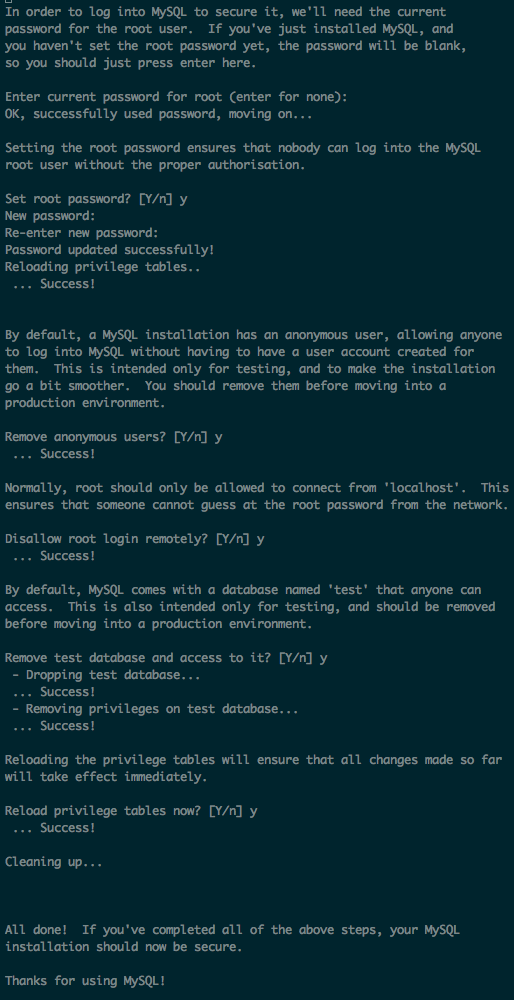

```
service mysqld start
```
#### Zabbix
```
rpm -ivh http://repo.zabbix.com/zabbix/3.4/rhel/6/x86_64/zabbix-release-3.4-1.el6.noarch.rpm
yum -y install zabbix-server-mysql zabbix-web-mysql

cat << EOT | mysql -uroot -ptoor
create database zabbix character set utf8 collate utf8_bin;
grant all privileges on zabbix.* to zabbix@localhost identified by 'zabbix';
EOT

zcat /usr/share/doc/zabbix-server-mysql*/create.sql.gz | mysql -uzabbix -pzabbix zabbix

cat << EOT >> /etc/zabbix/zabbix_server.conf
DBHost=localhost
DBName=zabbix
DBUser=zabbix
DBPassword=zabbix
EOT
service zabbix-server start
echo "mysql root password is 'toor'"
echo "mysql zabbix password is 'zabbix'"
```
#### PHP7 + Apache
```
yum install -y epel-release
rpm -Uvh http://rpms.famillecollet.com/enterprise/remi-release-6.rpm
sed -i "s/enabled=0/enabled=1/" /etc/yum.repos.d/remi-php70.repo

yum install -y httpd php php-fpm php-cli php-pdo php-mysql php-gd php-bcmath php-xml php-mbstring php-mcrypt php-redis
```
#### PHP 环境测试
```
cat <<EOT > /var/www/html/index.php
<?php phpinfo();
EOT
service httpd restart
```
此时访问 `http://45.32.202.169/` 应该能看到 PHP 环境信息


### 配置 Zabbix PHP 管理界面
```
cd /var/www/html
ln -s /usr/share/zabbix/
chown apache.apache /etc/zabbix/web/ -R
chown apache.apache /usr/share/zabbix/ -R
cat <<'EOT' > /etc/zabbix/web/zabbix.conf.php
<?php
// Zabbix GUI configuration file.
global $DB;

$DB['TYPE']     = 'MYSQL';
$DB['SERVER']   = 'localhost';
$DB['PORT']     = '0';
$DB['DATABASE'] = 'zabbix';
$DB['USER']     = 'zabbix';
$DB['PASSWORD'] = 'zabbix';

// Schema name. Used for IBM DB2 and PostgreSQL.
$DB['SCHEMA'] = '';

$ZBX_SERVER      = 'localhost';
$ZBX_SERVER_PORT = '10051';
$ZBX_SERVER_NAME = '';

$IMAGE_FORMAT_DEFAULT = IMAGE_FORMAT_PNG;
EOT
```

## 管理受控服务器

访问 http://45.32.202.169/zabbix/ 进入管理界面, 账号密码默认为 `Admin/zabbix`

### 进入管理主机管理
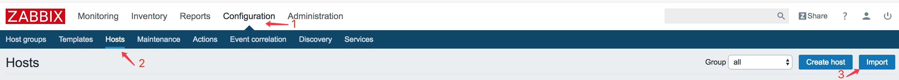

1. 点击 `Configuaration` 菜单项
1. 点击 `Hosts` 菜单项
1. 点击 `Import` 按钮

### 导入主机
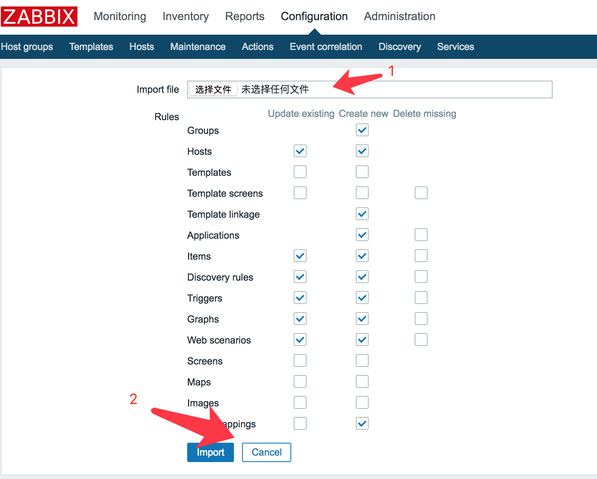

1. 点击 `Import file` 旁边的按钮选择[模板文件](zbx_export_hosts.xml)
1. 点击 `Import` 按钮

### 导入成功
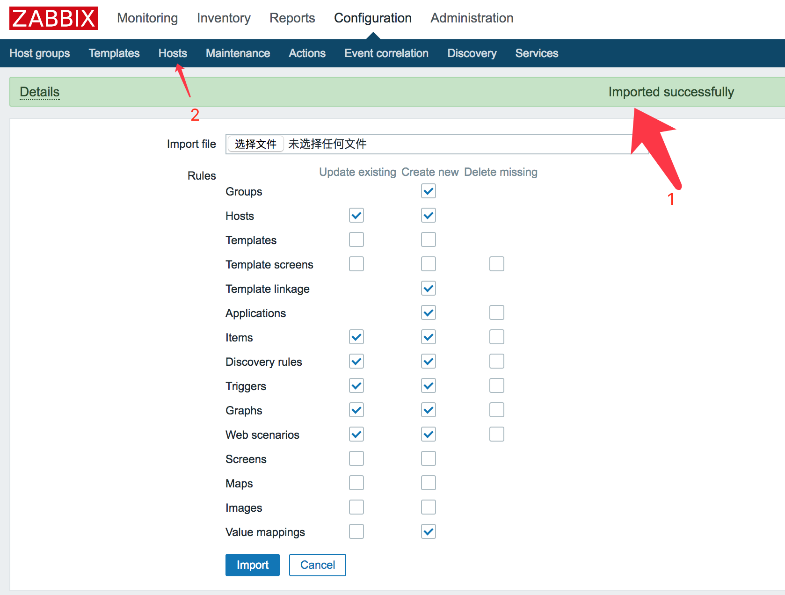

1. 看到绿色的提示信息表示导入成功
1. 点击 `Hosts` 菜单项返回主机管理

### 导入后的主机
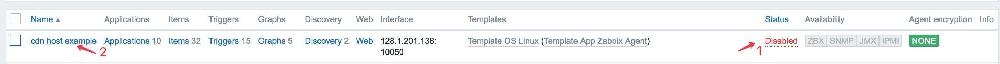

1. 看到绿色的提示信息表示导入成功
1. 点击 `Hosts` 菜单项返回主机管理

### 更新主机 IP 并激活
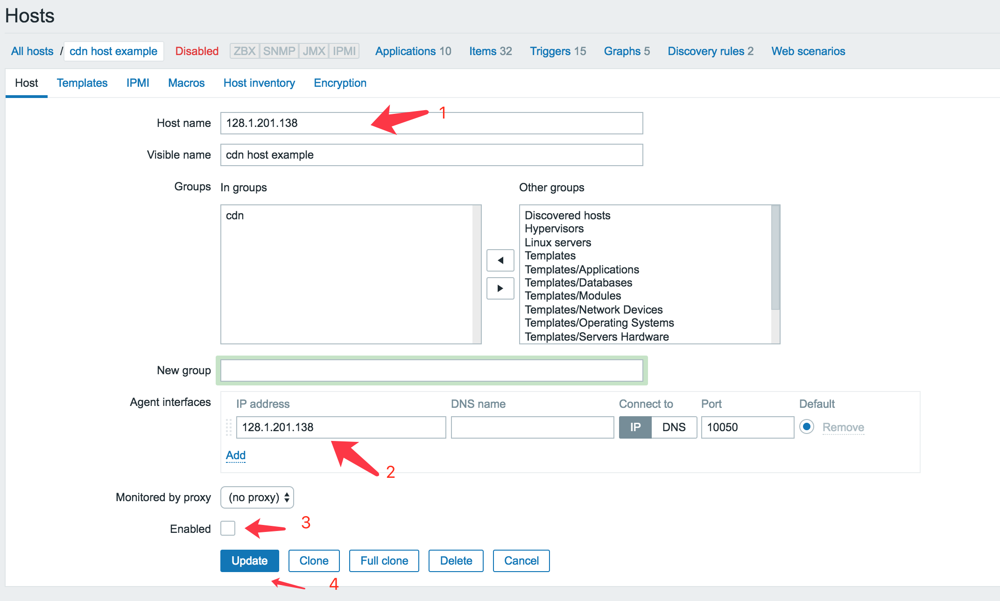

1. 相关 `IP` 请更新为受控服务器的实际 `IP`
1. `Enabled` 复选框必须选中
1. 点击 `Update` 按钮进行更新

### 更新完毕后服务器状态变为正常

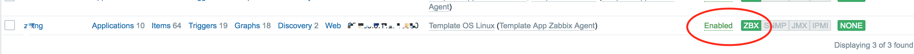

1. `ZBX`按钮变绿色，`Enabled` 变绿色的主机才是正常的主机
1. 需要等待约5到时候分钟受控服务器上的信息才会传到平台来，需要等待

# 受控服务器

## 安装
### 安装软件
#### centos
```
rpm -ivh http://repo.zabbix.com/zabbix/3.2/rhel/6/x86_64/zabbix-release-3.2-1.el6.noarch.rpm
yum install zabbix-agent -y
```
#### ubuntu

```
apt-get update
apt-get install zabbix-agent -y
```
### 配置

hostname 以系统配置的为准，这里设置的Hostname=xxx这种就不用了，所以注释掉了
```
cp /etc/zabbix/zabbix_agentd.conf{,.bak}
export ZABBIX_SERVER_IP=45.32.202.169
sed -i "s/Server=.*/Server=${ZABBIX_SERVER_IP}/" /etc/zabbix/zabbix_agentd.conf
sed -i "s/ServerActive=.*/ServerActive=${ZABBIX_SERVER_IP}/" /etc/zabbix/zabbix_agentd.conf
#sed -i "s/Hostname=Zabbix server/Hostname=hostname/" /etc/zabbix/zabbix_agentd.conf
mkdir -p /var/run/zabbix
chown -R zabbix:zabbix /var/run/zabbix
cat << EOT > /usr/lib/tmpfiles.d/zabbix.conf
d /var/run/zabbix 0711 zabbix zabbix
EOT
cat /usr/lib/tmpfiles.d/zabbix.conf
```

### 重启服务

#### centos

```
chkconfig zabbix-agent on
service zabbix-agent restart
```

#### ubuntu

```
systemctl restart zabbix-agent.service
systemctl status zabbix-agent.service
```

## 监控日志

```
tail -f /var/log/zabbix/zabbix_agentd.log
```


# Grafana 整合
## 安装 Grafana 和相关插件
```
curl -s https://packagecloud.io/install/repositories/grafana/stable/script.rpm.sh | sudo bash
sudo yum -q makecache -y --disablerepo='*' --enablerepo='grafana_stable'
yum install grafana -y

chkconfig grafana-server on
grafana-cli plugins install alexanderzobnin-zabbix-app
service grafana-server restart
```
## 配置 Grafana 以显示图表
### 登录
访问 http://45.32.202.169:3000 进入管理界面, 账号密码默认为 `admin/admin`
### 添加 `datasource` 数据源
### 首先激活插件

http://45.32.202.169:3000/plugins/alexanderzobnin-zabbix-app/edit

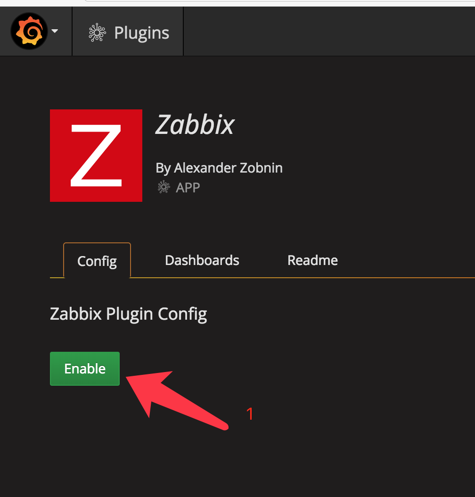

1. 点击 `Enable` 按钮激活插件
2. 然后回到首页 http://45.32.202.169:3000

#### 欢迎界面点击数据源配置按钮
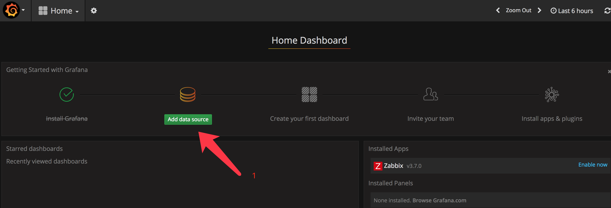

#### 填写对应的表单
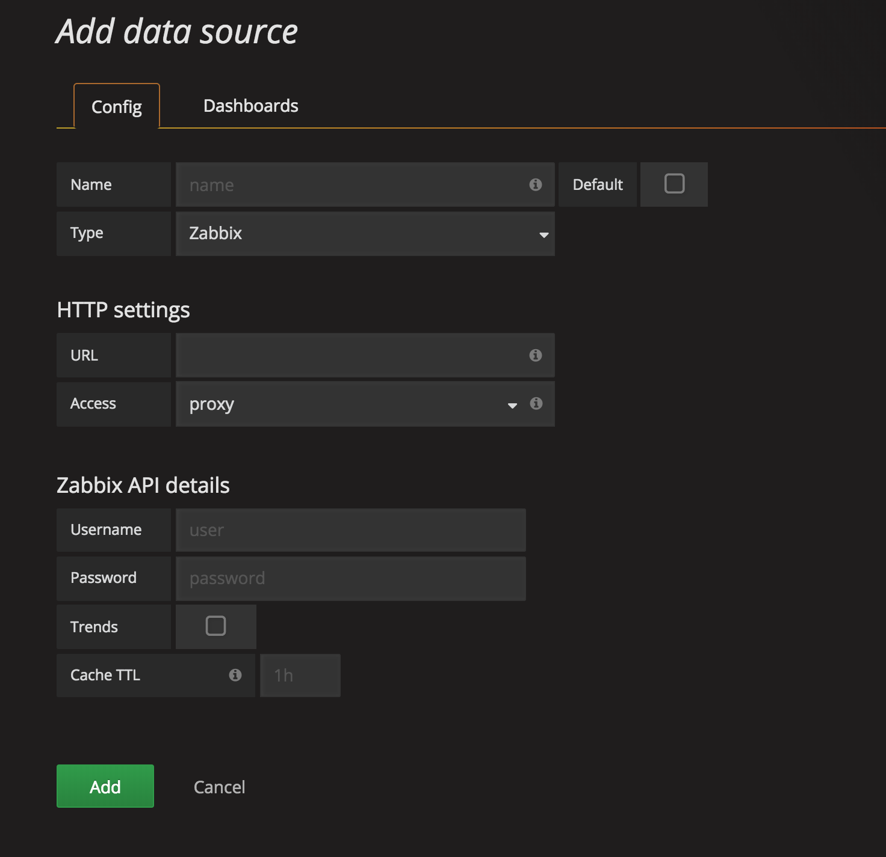
1.  `Name:` 随便填写，这里填 zabbix 吧
1.  `Default:  ` 设置为默认数据源，请选中
1.  `Type:` 请选择  `Zabbix`
1.  `Url:` 请填写 `http://45.32.202.169/zabbix/api_jsonrpc.php`
1.  `Username: ` 请填写 `Admin`
1.  `Password: ` 请填写 `zabbix`
1.  `Trends->Enabled:  ` 请选中
1.  请点击 `Add` 按钮

#### 导入相关的图表

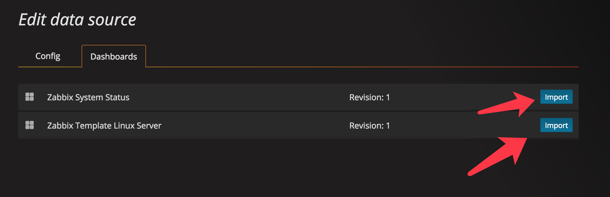

